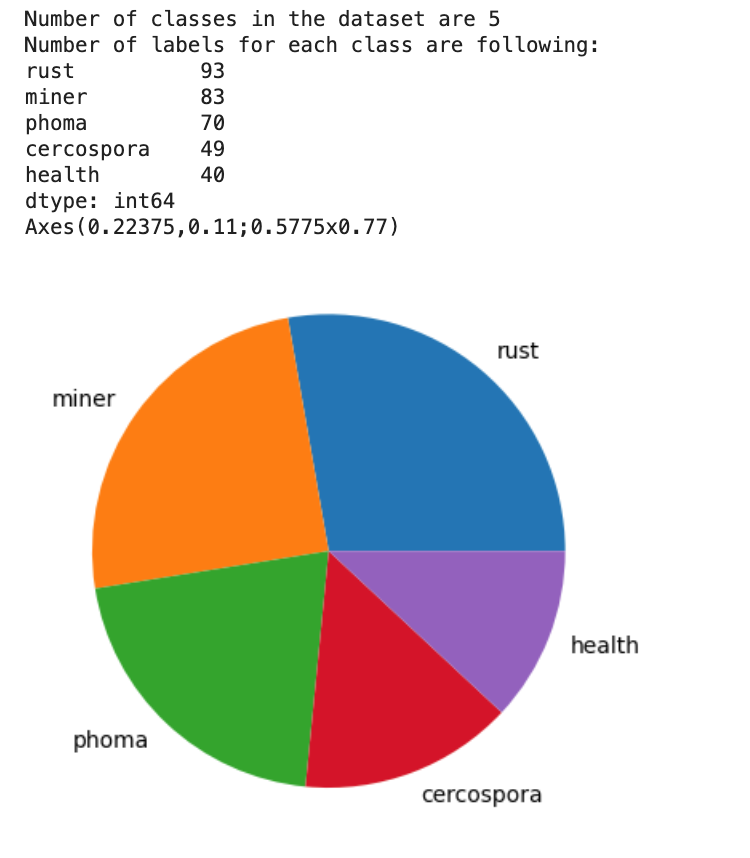

# Coffee-Disease-Identification-Omdena

Sao Paulo-based Local Chapter Challenge for the project titled "Classification of Plant Diseases in Brazilian Agriculture Using Computer Vision and Machine Learning." 

- Although it is an open-source collaborative project, I include only my contribution to the project here.
- I conducted a comprehensive literature survey, actively participated in data collection, and played an essential role in building models using deep learning techniques. Moreover, I contributed significantly to the development and deployment of a web application using Gradio/Streamlit.
- I include my contribution to the project and display the findings. 

# Customized CNN Model Trained Using BRACOL Symptoms Dataset

## Table of Contents
1. [Dataset](#dataset)
2. [Data Pre-processing](#data-pre-processing)
3. [Model Building](#model-building)
4. [Training](#training)
5. [Evaluation](#evaluation)
6. [Discussion](#discussion)

---

## Dataset

In this research dataset, two primary datasets, Leaf and Symptoms, along with their characteristics, a segmentation dataset, and data augmentation techniques are described.

**Leaf Dataset:**
The Leaf Dataset comprises a collection of 1747 images representing Arabica Coffee leaves, encompassing both healthy and diseased leaves. Each image in this dataset is labeled with the predominant biotic stress it exhibits. The possible stress values are categorized as follows: 
- 0 for healthy leaves
- 1 for miner-affected leaves
- 2 for rust-affected leaves
- 3 for phoma-affected leaves
- 4 for cercospora-affected leaves
- 5 for leaves with an undetermined issue.

Additionally, this dataset includes information on any secondary stresses present when a leaf is identified as unhealthy.

**Symptoms Dataset:**
The Symptoms Dataset is derived from the original dataset by cropping and isolating specific stress symptoms. Each image in this dataset contains only one stress symptom. In total, this dataset comprises 2722 images. The images are organized into train, validation, and test sets, and each of these sets further divides into five subfolders corresponding to the different stress categories: healthy, leaf miner, rust, phoma, and cercospora.

**Class Distribution in Leaf Dataset:**
- Healthy: 272 images
- Leaf miner: 387 images
- Rust: 531 images
- Brown leaf spot: 348 images
- Cercospora leaf spot: 147 images
- Total images: 1685 (after eliminating inconclusive predominant biotic stress images)

**Class Distribution in Symptoms Dataset:**
- Healthy: 256 images
- Leaf miner: 593 images
- Rust: 991 images
- Brown leaf spot: 504 images
- Cercospora leaf spot: 378 images
- Total images: 2722

**Data Split:**
The dataset is split into a standard 70-15-15 proportion for training, validation, and testing.
- Training images: 1545
- Validation images: 341
- Test images: 341

**Image Sizes:**
Image sizes within both the Leaf and Symptoms datasets vary. However, a Segmentation dataset has been created using the Symptoms dataset. In this Segmentation dataset, images have been cropped and resized to a consistent dimension of 2048 x 1024, ensuring that the leaf covers the majority of the image.

**Data Augmentation:**
Two primary data augmentation techniques have been applied to the datasets:
- Standard Augmentation: This includes horizontal and vertical mirroring, rotation, and variations in color, such as brightness, contrast, and saturation.
- Mixup: A novel approach inspired by Zhang et al. (2017), which generates new images by linearly combining two images and their corresponding labels. This dataset and its structured organization are essential resources for research in the field of Arabica Coffee leaf disease classification and diagnosis.

---

## Data Pre-Processing

1. **Importing Necessary Libraries:**
   - The code begins by importing various libraries required for the project which include pandas 1.5.3, numpy 1.23.5, matplotlib 3.7.1, and tensorflow 2.13.0.

2. **Mounting Google Drive:**
   - The notebook mounts Google Drive at `/content/drive`. This is done to access the BRACOL dataset stored in Google Drive for the challenge.

3. **Data Pre-processing:**
   - The code sets up several constants for image processing, such as `IMAGE_L` and `IMAGE_W` representing image dimensions (256x256 pixels), `BATCH_SIZE` for batch size which is 32, `SEED_VALUE` for reproducibility (i.e. 1728), and `n_channel` for the number of color channels (3 for RGB).

4. **Loading Dataset:**
   - Three datasets are loaded using `tf.keras.preprocessing.image_dataset_from_directory`:
     - `training_ds`: Training dataset loaded from '/content/drive/MyDrive/coffee-datasets/symptom/train'.
     - `validation_ds`: Validation dataset loaded from '/content/drive/MyDrive/coffee-datasets/symptom/val'.
     - `test_ds`: Test dataset loaded from '/content/drive/MyDrive/coffee-datasets/symptom/test'.
   - These datasets are created with specified batch sizes, image sizes, and data augmentation parameters. Each dataset is shuffled (shuffle = True).

5. **Extracting Class Names:**
   - The code extracts class names from the dataset by splitting class labels that include underscores. The resulting class names are: 'health', 'miner', 'rust', 'phoma', and 'cercospora'.

6. **Class Label Distribution Analysis:**
   - The `class_label_distribution` function is defined to analyze the distribution of class labels in each dataset (training, validation, and test).
   - It prints the number of classes in the dataset and the count of labels for each class.
   - The class distribution is visualized using pie charts.
   
   

   

   

   

7. **Data Optimization:**
   - In order to optimize the performance, tf.data API is used. The data is pre-fetched using `tf.data.Dataset.prefetch` transformation, which according to the documentation saves time by reading the data for the next step while the model is executing the current step. Furthermore, `tf.data.Dataset.cache` transformation is applied which saves time by caching the dataset in the memory.

---

## Model Building

### Overview of the Model Architecture
- We have used a Convolution Neural Network model for the use case, which takes several parameters for model configuration, including the number of convolutional layers, number of filters, number of dense layers, number of nodes in dense layers, and whether dropout is applied.
- The model consists of convolutional layers, max-pooling layers, and dense layers. It uses the 'relu' activation function for convolutional layers and softmax activation for the output layer.
- The model is compiled with the 'adam' optimizer and 'SparseCategoricalCrossentropy' loss function. Optimizer is not tuned at the moment.
- The model is trained using the `fit` method with the `train` dataset. Training continues for 100 epochs with a specified batch size of 32.
- Training and validation performance metrics, including loss and accuracy, are logged for each epoch.

### Detailed Description of Model Architecture:

1. **Rescaling Layer (Input Layer):**
   - This is the input layer, and it's not a part of the neural network itself. It simply scales the pixel values of the input images to a specified range. In this case, it scales the pixel values of the input images from [0, 255] to [0, 1], which is common for neural network input.

2. **Convolutional Layers:**
   - Each convolution has a ReLU activation function, which adds non-linearity to the model.
   - The neural network architecture includes a series of convolutional layers with progressively increasing complexity.
   - The first convolutional layer employs 32 filters of a 3x3 kernel size, resulting in 32 feature maps. These initial feature maps capture fundamental low-level image features like edges and basic textures, constituting a total of 896 parameters.
   - Subsequently, the second convolutional layer applies 64 filters to the feature maps derived from the previous layer, generating an output shape of (32, 128, 128, 64) and totaling 18,496 parameters. This layer delves deeper to extract more intricate features.
   - Moving forward, the third convolutional layer utilizes 128 filters to capture higher-level image features, leading to an output shape of (32, 64, 64, 128) and a parameter count of 73,856.
   - The fourth convolutional layer employs 192 filters for feature extraction, resulting in an output shape of (32, 32, 32, 192) and 221,376 parameters.
   - The subsequent layers continue to increase in complexity, with each subsequent layer employing more filters.
   - These layers progressively capture and extract increasingly complex features from the input data, which is essential for the neural network's overall performance.

3. **Max-Pooling Layers:**
   - In this neural network architecture, a series of eight Max-Pooling layers progressively reduce the spatial dimensions of the feature maps.
   - These Max-Pooling layers collectively contribute to feature reduction, a critical process in convolutional neural networks for feature extraction and dimensionality reduction.

4. **Flattening Layer:**
   - The Flatten Layer takes the feature maps and converts them into a 1D vector, preparing them for input into the fully connected layers.

5. **Dense Layer 1:**
   - Dense Layer 1 has 64 nodes followed by a ReLU activation function. It's a fully connected layer with 64 neurons, contributing to feature refinement.

6. **Batch Normalization:**
   - The Batch Normalization Layer comes after, maintaining the output shape at (32, 64). It serves to normalize the activations from the previous layer, enhancing convergence speed and overall training stability.

7. **Dropout Layer:**
   - The Dropout Layer is used with a probability of 0.5, guarding against overfitting.

8. **Dense Layer 2:**
   - Dense Layer 2, the output layer, has 5 neurons for the classification task, producing the final predictions. This layer uses Softmax activation to compute the probability for each of the five classes.

This model consists of a series of convolutional and max-pooling layers for feature extraction, followed by fully connected layers for classification. Batch normalization and dropout layers are used for regularization and stability during training.

---

## Model Training
- Prior to the model training (model.fit method), the model is compiled using the `model.compile` method with the Adam optimizer chosen with default hyperparameters (i.e., learning rate of 0.001).
- The model is trained for 100 epochs, with a batch size of 32.
- Model training is evaluated using metrics such as training accuracy, training loss, validation accuracy, and validation loss.

## Model Evaluation

